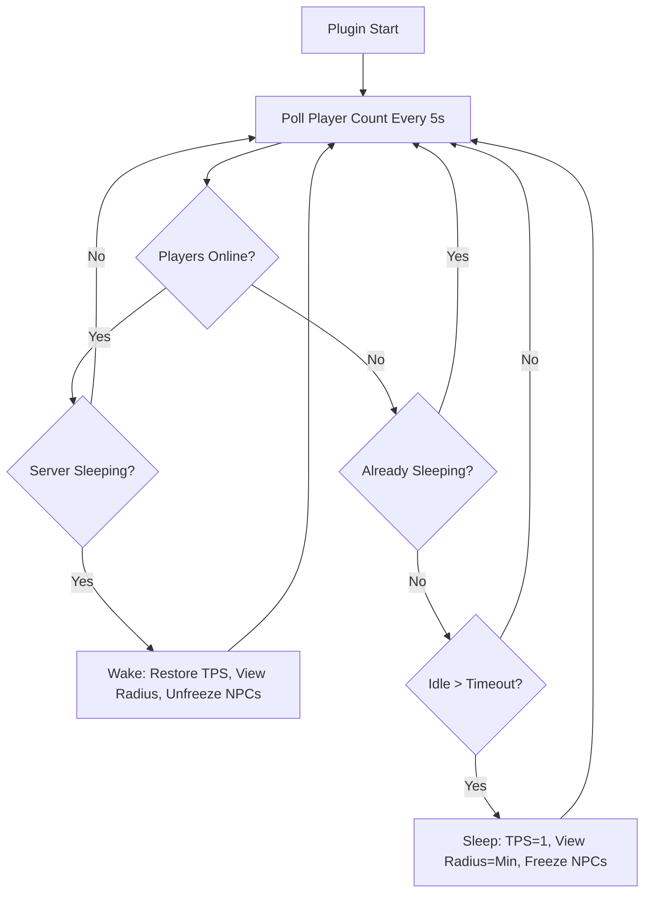

# Hytale AutoSleep Plugin

## Context

The Nitrado PerformanceSaver plugin already reduces TPS to 5 when the server is empty, but it takes 5 minutes to kick in and doesn't aggressively reduce resource usage. Our plugin goes further: after a configurable timeout, it drops TPS to 1, freezes NPCs, and minimizes view radius -- then instantly restores everything when a player connects.

The plugin uses the same API patterns proven by Nitrado's production plugins (`Universe.get()`, `World.setTps()`, `HytaleServer.SCHEDULED_EXECUTOR`, `HytaleServer.get().getConfig().setMaxViewRadius()`).

## Architecture



## Plugin Project Structure

New directory: `plugins/autosleep/`

```
plugins/autosleep/
  pom.xml                          # Maven build, depends on Hytale Server from maven.hytale.com
  src/main/
    java/com/shotah/hytale/plugins/autosleep/
      AutoSleepPlugin.java         # Main plugin class (extends JavaPlugin)
      AutoSleepConfig.java         # Config POJO for JSON config
    resources/
      manifest.json                # Plugin metadata (Group: Shotah, Name: AutoSleep)
```

## Key Implementation Details

### `AutoSleepPlugin.java`

- Extends `com.hypixel.hytale.server.core.plugin.JavaPlugin`
- In `start()`: schedules a recurring task via `HytaleServer.SCHEDULED_EXECUTOR` at a configurable interval (default: 5 seconds)
- Tracks `lastPlayerSeenAt` timestamp (same pattern as `TpsAdjuster.java`)
- **Sleep logic** (when idle exceeds timeout):
  - `world.setTps(1)` on all worlds (drops from default 20 to 1)
  - `HytaleServer.get().getConfig().setMaxViewRadius(2)` (minimum)
  - Log "Server entering sleep mode"
- **Wake logic** (when player count goes from 0 to >0):
  - `world.setTps(World.TPS)` to restore default (20)
  - Restore saved view radius
  - Log "Server waking up" and send message to connecting player

### `manifest.json`

```json
{
  "Group": "Shotah",
  "Name": "AutoSleep",
  "Version": "1.0.0",
  "Main": "com.shotah.hytale.plugins.autosleep.AutoSleepPlugin",
  "ServerVersion": "*"
}
```

### `pom.xml`

- Uses Maven with the official Hytale Maven repository (`https://maven.hytale.com/release`)
- Depends on `com.hypixel.hytale:Server:2026.02.19-1a311a592` as `provided` scope
- Uses `maven-shade-plugin` to build a fat JAR (same pattern as Nitrado plugins)

### Config (`mods/Shotah_AutoSleep/config.json`)

```json
{
  "Enabled": true,
  "SleepDelaySeconds": 300,
  "CheckIntervalSeconds": 5,
  "SleepTps": 1,
  "MinViewRadius": 2
}
```

## Docker Integration

### Environment Variable

- `ENABLE_AUTO_SLEEP` (default: `FALSE`) -- when `TRUE`, copies the plugin JAR to `mods/` on startup

### Dockerfile Change

Add a Maven build stage that compiles the plugin:

```dockerfile
FROM maven:3.9-eclipse-temurin-25 AS plugin-builder
WORKDIR /plugin
COPY plugins/autosleep/ .
RUN mvn package -q -DskipTests
```

Then copy the JAR into the final image at a staging location (not directly into mods, since mods is user data):

```dockerfile
COPY --from=plugin-builder /plugin/target/autosleep-*.jar /usr/local/lib/plugins/autosleep.jar
```

### Entrypoint Change

In `entrypoint.sh`, before server launch, conditionally copy the plugin:

```sh
if [ "$ENABLE_AUTO_SLEEP" = "TRUE" ]; then
    mkdir -p "$BASE_DIR/mods"
    cp /usr/local/lib/plugins/autosleep.jar "$BASE_DIR/mods/"
fi
```

### Documentation

- Add `ENABLE_AUTO_SLEEP` to README.md, docs/technical/docker.md, and full-featured example
- Note that AutoSleep and the Nitrado PerformanceSaver plugin are complementary (PerformanceSaver handles resource pressure while players are online; AutoSleep handles the empty server case)

## Build Considerations

- The Maven build requires network access to pull from `maven.hytale.com` -- this happens at Docker image build time only
- The plugin JAR is small (a few KB) since the server dependency is `provided` scope
- CI/CD: the existing GitHub Actions workflow will need the Maven build stage added to the Dockerfile
- The plugin version should match the container version for simplicity

## What This Does NOT Do

- This does NOT stop the JVM or Docker container (that would prevent accepting new connections)
- This does NOT act as a TCP/UDP proxy (Hytale uses QUIC, making that impractical)
- Instead, it minimizes CPU/RAM usage while keeping the server process alive and able to accept connections instantly
